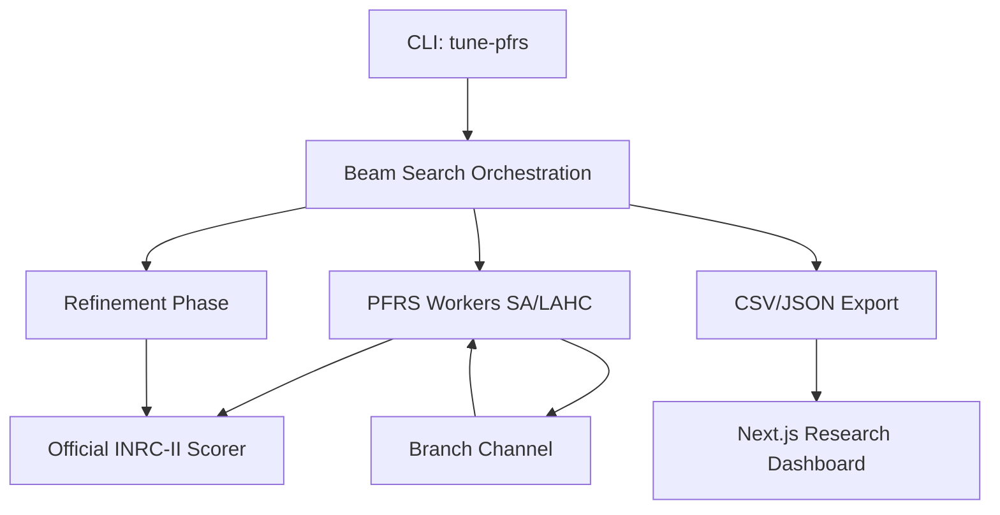
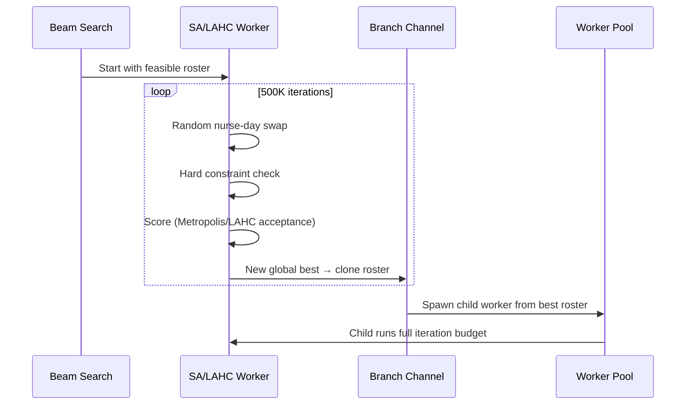

# PFRS — Parallel Feasible Roster Search

A research platform for nurse rostering optimisation using the INRC-II benchmark.

PFRS combines simulated annealing, late acceptance hill climbing, parallel branching, beam search, and amortized constraint look-ahead into a unified system for exploring nurse scheduling heuristics.

## The Nurse Rostering Problem

The Nurse Rostering Problem (NRP) is one of the hardest combinatorial optimisation problems in operations research. Given a set of nurses, a planning horizon of days, shift types, skill requirements, and contractual constraints, the task is to assign exactly one shift (or a day off) to every nurse on every day such that all hard constraints are satisfied and soft constraint violations are minimised.

The problem is NP-hard. Even for small instances (12 nurses, 8 weeks), the search space contains approximately $3^{672}$ possible assignments (3 shift options per nurse per day, 12 nurses × 56 days). Exhaustive search is impossible. Heuristic methods are the only practical approach.

### Why NRP is Difficult

- **Competing objectives**: Coverage requirements conflict with fairness rules. Giving one nurse more shifts satisfies coverage but violates assignment balance.
- **Long-range dependencies**: A shift assigned on day 1 can affect penalties on day 56 through consecutive-day and total-assignment counters.
- **Hard constraint feasibility**: Many swap operations produce invalid rosters (skill violations, forbidden successions). The feasible region is sparse.
- **Deferred penalties**: Some constraints (total assignments, total weekends) only evaluate at the horizon end, creating invisible debt that explodes in the final week.

### Real-World Impact

In healthcare operations, poor rosters cause:
- Understaffing (patient safety risk)
- Nurse burnout (consecutive working days exceeded)
- Unfair weekend distribution (retention problems)
- Contractual violations (legal liability)
- Manual rework (operations manager spends hours adjusting generated schedules)

A roster with zero hard violations and minimal soft constraint violations represents a schedule where every nurse gets fair treatment, every shift is adequately staffed, and legal requirements are met.

## The INRC-II Benchmark

PFRS uses the [Second International Nurse Rostering Competition](http://mobiz.vives.be/inrc2/) (INRC-II) dataset format. This is the standard academic benchmark for nurse rostering research.

### Instance Structure

Each instance consists of:
- **Scenario** (`Sc-*.json`) — Nurses, contracts, shift types, skills, forbidden successions
- **Week Data** (`WD-*.json`) — Per-week coverage requirements and shift-off requests
- **History** (`H0-*.json`) — Rolling state from previous weeks (consecutive days, assignments, weekends)

### Planning Model

The INRC-II models a rolling horizon: an 8-week planning period processed week by week. After solving each week, history is updated and carried forward to the next. This simulates real-world operations where schedules are produced weekly based on accumulated state.

### Constraints

**Hard constraints** (must be satisfied — solutions with violations are invalid):
- H1: Single assignment per nurse per day
- H2: Nurse must have required skill for assigned shift
- H3: Minimum staffing coverage per shift/day

**Soft constraints** (minimise violations — each costs a weighted penalty):

| Code | Constraint | Weight | Scope |
|------|-----------|--------|-------|
| S1 | Optimal coverage (above min, below optimal) | 30 | Per week |
| S2 | Consecutive working days (min/max) | 30 | Per week |
| S3 | Consecutive days off (min/max) | 30 | Per week |
| S4 | Consecutive same shift type (min/max) | 30 | Per week |
| S5 | Complete weekends (work both Sat+Sun or neither) | 30 | Per week |
| S6 | Shift-off requests | 10 | Per week |
| S7 | Total assignments over horizon (min/max) | 20 | Final week only |
| S8 | Total working weekends (max) | 30 | Final week only |

The total penalty is the sum across all nurses and all weeks. Lower is better. Zero hard violations is mandatory.

### Available Datasets

| Instance | Nurses | Weeks | Difficulty |
|----------|--------|-------|------------|
| n005w4 | 5 | 4 | Small (testing) |
| n012w8 | 12 | 8 | Medium (primary benchmark) |
| n030w4 | 30 | 4 | Large (competition) |
| n030w8 | 30 | 8 | Large (competition) |
| n060w4 | 60 | 4 | Very large |
| n060w8 | 60 | 8 | Very large |
| n080w4 | 80 | 4 | Extreme |
| n100w4 | 100 | 4 | Extreme |
| n120w4 | 120 | 4 | Extreme |

PFRS currently targets **n012w8** as the primary research instance. This is large enough to be challenging (12 nurses × 8 weeks × 3 shifts = 672 decision variables) while small enough to run many experiments quickly.

### Competition Context

The INRC-II competition attracted entries from research groups worldwide using methods including integer programming (CPLEX/Gurobi), constraint programming, genetic algorithms, simulated annealing, tabu search, and hyper-heuristics. Best-known solutions for n012w8 instances range from approximately 2,800 to 4,200 total penalty depending on the specific week-data files used.

PFRS achieves results competitive with published academic work using a general-purpose metaheuristic approach rather than a problem-specific decomposition.

## Why PFRS Exists

Most nurse rostering papers report a final penalty number. They don't explain *why* the algorithm found that solution, *when* it stopped being productive, or *which* design decisions mattered.

PFRS was built to answer those questions. Every run produces full telemetry — discovery events, beam ancestry, lineage entropy, innovation attribution, and search health diagnostics. The goal is not just to find good rosters, but to understand how and why optimisation effort creates value.

## Architecture



The system separates concerns cleanly:

- **Domain** — INRC-II scenario, roster, history, solution types
- **Search** — SA/LAHC workers, branching, parallel pool
- **Orchestration** — Beam search, final window coupling, refinement
- **Scoring** — Official INRC-II validator (never modified for heuristics)
- **Instrumentation** — Discovery events, tree nodes, diversity metrics
- **Dashboard** — Next.js app consuming CSV telemetry

## Search Process



Each worker:
1. Starts from a hard-feasible roster (greedy construction with backtracking)
2. Generates random nurse-day swaps
3. Rejects hard-invalid swaps instantly (skill, succession, single-assignment)
4. Scores valid swaps using the official INRC-II soft penalty function
5. Accepts improvements always; accepts worse moves probabilistically (SA) or by late fitness (LAHC)
6. When a new global best is found, clones the roster and spawns a child worker

All workers run their full iteration budget. No early stopping. The parent continues exploring independently of the child.

## Beam Search

The planning horizon spans 8 weeks. Each week is optimised independently but history connects them:


For each week:
1. Expand each retained path with each beam seed
2. Run PFRS on each expansion
3. Rank candidates by cumulative penalty + strategy bias
4. Retain top `beamWidth` (with optional diversity reservation)

**Final Window Coupling** (`--pfrs-final-window-weeks 2`): Instead of pruning between weeks 7 and 8, all candidates run both weeks sequentially. Pruning only after seeing the combined outcome.

## SA / LAHC Modes

Both modes use the same swap neighbourhood and hard constraint validation. They differ only in acceptance criterion:

**Simulated Annealing** (`--pfrs-mode sa`):
- Accepts improvements always
- Accepts worse with probability `e^(-Δ/T)`
- Temperature cools geometrically: `T *= (1 - rate)` per scored candidate
- Adaptive cooling: rate auto-computed to reach min temp at iteration budget

### SA Mathematics

Acceptance probability:

$$P(\text{accept}) = \begin{cases} 1 & \text{if } \Delta \leq 0 \\ e^{-\Delta / T} & \text{if } \Delta > 0 \end{cases}$$

Where $\Delta = f(x') - f(x)$ (new penalty minus current penalty).

Geometric cooling:

$$T_{i+1} = T_i \cdot (1 - \alpha)$$

Adaptive cooling rate (reaches $T_{\min}$ at iteration $N$):

$$\alpha = 1 - \left(\frac{T_{\min}}{T_0}\right)^{1/N}$$

**Late Acceptance Hill Climbing** (`--pfrs-mode lahc`):
- Accepts if `penalty ≤ current` OR `penalty ≤ fitnessArray[v]`
- Buffer length auto-scales to 3% of iterations
- No temperature parameter — simpler to tune

### LAHC Mathematics

Acceptance criterion at iteration $i$ with buffer index $v = i \mod L$:

$$\text{accept}(x') = f(x') \leq f(x) \quad \lor \quad f(x') \leq F[v]$$

Buffer update after acceptance:

$$F[v] \leftarrow f(x')$$

Buffer length scaling:

$$L = \lfloor 0.03 \cdot N \rfloor$$

Where $N$ is the iteration budget per worker.

## Look-Ahead Strategies

The INRC-II scorer only evaluates total assignments (S7) and total weekends (S8) at the final week. This creates a "global debt" trap — nurses accumulate violations invisibly until week 8 explodes.

**Strategy: `lookahead`** — Projects current trajectories forward. Time-scaled weight (weak early, strong late). Asymmetric: aggressive on max overshoot, relaxed on min undershoot. Floor-based: only full-weight penalty if mathematically guaranteed to bust.

**Strategy: `budget`** — Divides contractual limits by total weeks. Penalises paths exceeding their per-week budget immediately. Simpler and more direct.

Both strategies only affect beam ranking. The official score is never modified.

### Look-Ahead Evaluation Function (Amortized Dynamic Boundary Heuristic)

$$\Phi(x) = f(x) + \left(\omega \cdot \frac{w}{W}\right) \cdot \sum_{n \in N} \left[ \max(0, \hat{A}_n(x) - A_{\max}) \cdot \beta_1 + \max(0, \hat{W}_n(x) - W_{\max}) \cdot \beta_2 \right]$$

Where:
- $f(x)$ = cumulative official penalty
- $\omega$ = `--pfrs-lookahead-weight`
- $w/W$ = current week / total weeks (time scaling)
- $\hat{A}_n(x)$ = projected total assignments for nurse $n$
- $A_{\max}$ = contractual maximum assignments
- $\beta_1 = 20$ (matches official S7 penalty rate)
- $\hat{W}_n(x)$ = projected total weekends for nurse $n$
- $W_{\max}$ = contractual maximum weekends
- $\beta_2 = 30$ (matches official S8 penalty rate)

### Budget Strategy

$$B_{\text{penalty}}(x) = \sum_{n \in N} \left[ \max\left(0, A_n - \frac{A_{\max} \cdot w}{W}\right) \cdot 20 + \max\left(0, W_n - \frac{W_{\max} \cdot w}{W}\right) \cdot 30 \right]$$

This computes the exact per-week budget overshoot rather than projecting forward. Simpler, more direct, no guessing.

## Diversity Slots

Pure penalty ranking causes beam collapse — one family dominates and all diversity dies by mid-horizon.

`--pfrs-diversity-slots 30` reserves 30% of beam width for paths from underrepresented families. The top 70% are greedy (best penalty). The bottom 30% are the best candidates from families not already represented. This prevents monopoly without accepting garbage.

## Search Tree

Every beam path is recorded with:
- Path ID, parent ID, week, seed
- Week penalty, cumulative penalty
- Retained rank, winning flag
- Workers started, candidates evaluated, SA acceptance breakdown

This enables post-hoc ancestry analysis without runtime overhead.

## Research Dashboard

The PFRS Research Lab is a Next.js application that loads run telemetry from `data/runs/<label>/` and provides:

| Page | Research Question |
|------|-------------------|
| Summary | What were the final numbers? |
| Schedule | What does the actual roster look like? |
| Search Progress | When did discoveries happen? Was search effort productive? |
| Search Tree | How did the beam evolve? |
| Inheritance | Which families create value? Is the beam efficient? |
| Insights | Why did the search behave this way? What should change? |
| Diversity | Are retained paths structurally different? |

## Inheritance Analysis

Measures the "genetics" of beam search:
- **Lineage Entropy** — Shannon entropy over ancestor families per week
- **Innovation Index** — Improvement generated per descendant
- **Ancestor Lifetime** — How many generations each lineage persists
- **Weekly Knowledge Transfer** — Inherited quality vs new discovery per week
- **Beam Health Score** — Composite 0-100 search quality indicator

### Lineage Entropy

$$H(w) = -\sum_{f \in \text{Families}} p_f \cdot \log_2(p_f)$$

Where $p_f$ = proportion of retained paths descending from family $f$ at week $w$.

Normalised entropy: $\hat{H}(w) = H(w) / \log_2(|\text{Families}|)$

- $\hat{H} = 1.0$ → perfectly balanced diversity
- $\hat{H} = 0.0$ → complete beam collapse (one family owns everything)

### Beam Health Score

$$\text{Score} = \underbrace{H_{\text{norm}} \cdot 30}_{\text{diversity}} + \underbrace{\min(1, r/10) \cdot 30}_{\text{innovation}} - \underbrace{(p_{\max}/100) \cdot 20}_{\text{monopoly}} - \underbrace{|\{w : H(w) < 0.35\}| \cdot 5}_{\text{collapse penalty}}$$

Where $r$ = global best discoveries per week, $p_{\max}$ = peak family dominance %.

### Innovation Efficiency

$$\eta_f = \frac{\sum_{c \in \text{children}(f)} \max(0, f_{\text{penalty}} - c_{\text{penalty}})}{|\text{descendants}(f)|}$$

High efficiency = family produces improvements, not just copies.

## Diversity Analysis

- **Beam Spread** — Penalty gap between best and worst retained paths
- **Hamming Distance** — Roster structural distance between paths
- **Near-Duplicate Detection** — Paths with <5% Hamming distance
- **Fingerprinting** — MD5 hash of roster assignments for fast comparison

### Hamming Distance

$$d(R_a, R_b) = \frac{|\{(n, d) : R_a[n][d] \neq R_b[n][d]\}|}{|N| \cdot |D|}$$

Where $R[n][d]$ = shift assignment for nurse $n$ on day $d$. Returns 0.0 for identical rosters, 1.0 for completely different.

## Insights Engine

Automatically generates evidence-based observations:
- Beam collapse detection (entropy < 0.35)
- Innovation monopoly analysis
- Lineage lifetime charts
- Effective beam width vs nominal
- Exploration/exploitation balance
- Wasted compute detection (% candidates after last global improvement)
- Evidence-backed tuning recommendations

## Refinement Phase

Optional post-processing pass on the winning solution:
- Uses **violation count** as objective (not weighted penalty)
- Runs per-week SA/LAHC/hill-climb with correct rolling history
- Gates on violation count: only keeps refined solution if violations decreased
- Reports both official penalty and violation count before/after

```
--pfrs-refinement sa --pfrs-refinement-iterations 200000
```

## Running Experiments

All commands run from `platform/go`. Each produces a labelled run in `data/runs/<label>/` viewable in the dashboard.

## Experiment Catalogue

### 1. Pure Baseline

The control. No look-ahead, no diversity reservation, no refinement. This is what the algorithm achieves with raw SA + branching alone. Every other experiment should be compared against this.

```bash
go run ./cmd/owp tune-pfrs --pfrs-beam-width 5 --pfrs-beam-seeds 42,101,202 --pfrs-run-label baseline
```

### 2. SA vs LAHC

Same configuration, different core algorithm. LAHC has no temperature parameter — it's controlled solely by buffer length. We expect different exploration/exploitation profiles. Check the Insights page for exploration % and yield curves.

```bash
go run ./cmd/owp tune-pfrs --pfrs-beam-width 5 --pfrs-beam-seeds 42,101,202 --pfrs-mode sa --pfrs-run-label sa-500k
go run ./cmd/owp tune-pfrs --pfrs-beam-width 5 --pfrs-beam-seeds 42,101,202 --pfrs-mode lahc --pfrs-run-label lahc-500k
```

### 3. Iteration Budget Sweep

Tests diminishing returns on compute. The discovery yield chart will show exactly when each budget stops being productive. If 100K achieves 90% of what 1M achieves, the extra 900K is wasted.

```bash
go run ./cmd/owp tune-pfrs --pfrs-beam-width 5 --pfrs-beam-seeds 42,101,202 --iterations 100000 --pfrs-run-label sa-100k
go run ./cmd/owp tune-pfrs --pfrs-beam-width 5 --pfrs-beam-seeds 42,101,202 --iterations 500000 --pfrs-run-label sa-500k
go run ./cmd/owp tune-pfrs --pfrs-beam-width 5 --pfrs-beam-seeds 42,101,202 --iterations 1000000 --pfrs-run-label sa-1m
```

### 4. Beam Width Sweep

Tests whether wider beams maintain diversity longer. Wider beam = more compute per week but potentially better week 8 outcome due to more ancestral families surviving. Check lineage entropy — does it stay above 0.35 longer with wider beam?

```bash
go run ./cmd/owp tune-pfrs --pfrs-beam-width 3 --pfrs-beam-seeds 42,101,202 --pfrs-run-label beam-3
go run ./cmd/owp tune-pfrs --pfrs-beam-width 5 --pfrs-beam-seeds 42,101,202 --pfrs-run-label beam-5
go run ./cmd/owp tune-pfrs --pfrs-beam-width 12 --pfrs-beam-seeds 42,101,202,303,404 --pfrs-run-label beam-12
```

### 5. Beam Strategy Comparison

Tests whether guiding beam selection with global constraint awareness helps. The hypothesis: budget/lookahead strategies prevent the "global debt" trap where nurses silently exceed assignment/weekend caps until week 8 explodes. Risk: too much bias kills diversity.

```bash
go run ./cmd/owp tune-pfrs --pfrs-beam-width 12 --pfrs-beam-seeds 42,101,202,303,404 --pfrs-beam-strategy none --pfrs-run-label strategy-none
go run ./cmd/owp tune-pfrs --pfrs-beam-width 12 --pfrs-beam-seeds 42,101,202,303,404 --pfrs-beam-strategy lookahead --pfrs-lookahead-weight 1.0 --pfrs-run-label strategy-lookahead
go run ./cmd/owp tune-pfrs --pfrs-beam-width 12 --pfrs-beam-seeds 42,101,202,303,404 --pfrs-beam-strategy budget --pfrs-lookahead-weight 1.0 --pfrs-run-label strategy-budget
```

### 6. Look-Ahead Weight Sweep

Tests how much strategy bias is optimal. Too low = no effect. Too high = forces convergence to one safe path, kills diversity, wastes beam width. The sweet spot should show improved week 8 penalty without collapsing beam health below 50.

```bash
go run ./cmd/owp tune-pfrs --pfrs-beam-width 12 --pfrs-beam-seeds 42,101,202,303,404 --pfrs-beam-strategy budget --pfrs-lookahead-weight 0.5 --pfrs-run-label budget-w0.5
go run ./cmd/owp tune-pfrs --pfrs-beam-width 12 --pfrs-beam-seeds 42,101,202,303,404 --pfrs-beam-strategy budget --pfrs-lookahead-weight 1.0 --pfrs-run-label budget-w1.0
go run ./cmd/owp tune-pfrs --pfrs-beam-width 12 --pfrs-beam-seeds 42,101,202,303,404 --pfrs-beam-strategy budget --pfrs-lookahead-weight 4.0 --pfrs-run-label budget-w4.0
```

### 7. Diversity Slots Effectiveness

Tests whether forced diversity preservation improves final outcomes. Without slots, one dominant family kills all competition by week 3. With slots, weaker families survive longer and may produce late-game innovations. Check innovation monopoly chart — does it stay below 80%?

```bash
go run ./cmd/owp tune-pfrs --pfrs-beam-width 12 --pfrs-beam-seeds 42,101,202,303,404 --pfrs-beam-strategy budget --pfrs-lookahead-weight 1.0 --pfrs-diversity-slots 0 --pfrs-run-label diversity-0
go run ./cmd/owp tune-pfrs --pfrs-beam-width 12 --pfrs-beam-seeds 42,101,202,303,404 --pfrs-beam-strategy budget --pfrs-lookahead-weight 1.0 --pfrs-diversity-slots 30 --pfrs-run-label diversity-30
go run ./cmd/owp tune-pfrs --pfrs-beam-width 12 --pfrs-beam-seeds 42,101,202,303,404 --pfrs-beam-strategy budget --pfrs-lookahead-weight 1.0 --pfrs-diversity-slots 50 --pfrs-run-label diversity-50
```

### 8. Final Window Coupling

Tests whether the week 8 penalty explosion is caused by greedy week 7 pruning. With coupling, all 15 week 7 candidates see their week 8 consequences before any pruning. If week 8 penalty drops significantly, the boundary was the bottleneck. If not, the problem is structural (history accumulation).

```bash
go run ./cmd/owp tune-pfrs --pfrs-beam-width 12 --pfrs-beam-seeds 42,101,202,303,404 --pfrs-final-window-weeks 1 --pfrs-run-label window-1
go run ./cmd/owp tune-pfrs --pfrs-beam-width 12 --pfrs-beam-seeds 42,101,202,303,404 --pfrs-final-window-weeks 2 --pfrs-run-label window-2
go run ./cmd/owp tune-pfrs --pfrs-beam-width 12 --pfrs-beam-seeds 42,101,202,303,404 --pfrs-final-window-weeks 2 --pfrs-final-window-iterations 2000000 --pfrs-run-label window-2-2m
```

### 9. Refinement Algorithm Comparison

Tests whether a post-processing polish pass can reduce soft constraint violations. Refinement uses violation count as its objective (not weighted penalty). Hill climb only accepts improvements. SA accepts worse moves to escape local optima. LAHC provides a middle ground.

```bash
go run ./cmd/owp tune-pfrs --pfrs-beam-width 5 --pfrs-beam-seeds 42,101,202 --pfrs-refinement none --pfrs-run-label refine-none
go run ./cmd/owp tune-pfrs --pfrs-beam-width 5 --pfrs-beam-seeds 42,101,202 --pfrs-refinement hillclimb --pfrs-refinement-iterations 200000 --pfrs-run-label refine-hc
go run ./cmd/owp tune-pfrs --pfrs-beam-width 5 --pfrs-beam-seeds 42,101,202 --pfrs-refinement sa --pfrs-refinement-iterations 200000 --pfrs-run-label refine-sa
go run ./cmd/owp tune-pfrs --pfrs-beam-width 5 --pfrs-beam-seeds 42,101,202 --pfrs-refinement lahc --pfrs-refinement-iterations 200000 --pfrs-run-label refine-lahc
```

### 10. Temperature Sweep (SA)

Tests the exploration/exploitation trade-off. Low temperature (10) = nearly greedy, finds local optima fast but may miss better basins. High temperature (500) = explores broadly early but may not converge within the iteration budget. The adaptive cooling adjusts the rate to always reach minimum by the end.

```bash
go run ./cmd/owp tune-pfrs --pfrs-beam-width 5 --pfrs-beam-seeds 42,101,202 --temperature 10 --pfrs-run-label temp-10
go run ./cmd/owp tune-pfrs --pfrs-beam-width 5 --pfrs-beam-seeds 42,101,202 --temperature 100 --pfrs-run-label temp-100
go run ./cmd/owp tune-pfrs --pfrs-beam-width 5 --pfrs-beam-seeds 42,101,202 --temperature 500 --pfrs-run-label temp-500
```

### 11. Branching Depth (Max Workers)

Tests whether deep branching trees actually produce better solutions than shallow ones. With unlimited workers, a single week can spawn 60-80 workers. Many of these start from nearly-identical rosters and produce diminishing returns. Capping workers tests whether 5-20 focused workers outperform 80 redundant ones.

```bash
go run ./cmd/owp tune-pfrs --pfrs-beam-width 5 --pfrs-beam-seeds 42,101,202 --pfrs-max-total-workers 5 --pfrs-run-label workers-5
go run ./cmd/owp tune-pfrs --pfrs-beam-width 5 --pfrs-beam-seeds 42,101,202 --pfrs-max-total-workers 20 --pfrs-run-label workers-20
go run ./cmd/owp tune-pfrs --pfrs-beam-width 5 --pfrs-beam-seeds 42,101,202 --pfrs-run-label workers-unlimited
```

### 12. Full Experiment (everything enabled)

Maximum compute, all features active. This represents the best possible result the current architecture can produce. Compare against the pure baseline to measure total value added by all features combined.

```bash
go run ./cmd/owp tune-pfrs --pfrs-beam-width 12 --pfrs-beam-seeds 42,101,202,303,404 --iterations 1500000 --pfrs-beam-strategy budget --pfrs-lookahead-weight 1.0 --pfrs-diversity-slots 30 --pfrs-final-window-weeks 2 --pfrs-final-window-iterations 3000000 --pfrs-no-reheat --pfrs-mode sa --pfrs-refinement sa --pfrs-refinement-iterations 500000 --pfrs-max-concurrent 16 --pfrs-run-label full-experiment
```

## CLI Reference

| Flag | Default | Description |
|------|---------|-------------|
| `--pfrs-mode` | sa | Worker algorithm: `sa` or `lahc` |
| `--iterations` | 500000 | Iterations per worker |
| `--temperature` | 100.0 | SA initial temperature |
| `--pfrs-beam-width` | 1 | Paths retained per week |
| `--pfrs-beam-seeds` | 42 | Seeds for beam expansion |
| `--pfrs-beam-strategy` | none | Beam ranking: `none`, `lookahead`, `budget` |
| `--pfrs-lookahead-weight` | 0 | Look-ahead/budget scaling factor |
| `--pfrs-diversity-slots` | 0 | % of beam reserved for diversity |
| `--pfrs-final-window-weeks` | 1 | Weeks coupled at end (1 = normal) |
| `--pfrs-final-window-iterations` | 0 | Iteration override for final window |
| `--pfrs-refinement` | none | Refinement mode: `none`, `sa`, `lahc`, `hillclimb` |
| `--pfrs-refinement-iterations` | 100000 | Iterations per week for refinement |
| `--pfrs-refinement-temperature` | 10.0 | SA temp for refinement |
| `--pfrs-max-concurrent` | NumCPU | Max concurrent goroutines |
| `--pfrs-max-total-workers` | 0 | Max total workers (0 = unlimited) |
| `--pfrs-no-reheat` | false | Disable stagnation reheating |
| `--pfrs-reheat-threshold` | 50000 | Candidates without improvement before reheat |
| `--pfrs-reheat-factor` | 1.0 | Fraction of initial temp on reheat |
| `--pfrs-run-label` | — | Save output to `data/runs/<label>/` |
| `--pfrs-late-acceptance-length` | auto | LAHC buffer size (auto = 3% of iterations) |

## Folder Structure

```
platform/
├── go/
│   ├── cmd/owp/main.go              # CLI entry point
│   └── internal/infrastructure/inrc2/
│       ├── pfrs.go                   # Roster, feasible builder
│       ├── pfrs_search.go           # SA/LAHC workers, swap operator
│       ├── pfrs_beam.go             # Beam search orchestration
│       ├── pfrs_lookahead.go        # Look-ahead + budget strategies
│       ├── pfrs_refinement.go       # Post-processing refinement
│       ├── pfrs_tree.go             # Fingerprint, Hamming, tree metrics
│       ├── pfrs_audit.go            # Audit types, discovery events
│       ├── discoveries_csv.go       # Discovery CSV export
│       ├── diversity_csv.go         # Diversity CSV export
│       ├── beam_tree_csv.go         # Beam tree CSV export
│       ├── roster_csv.go            # Final roster JSON export
│       ├── scorer.go                # Official INRC-II scorer
│       ├── parser.go                # Scenario/WeekData/History parsing
│       └── history.go               # History update logic
└── web/pfrs-lab/
    ├── src/app/                      # Next.js pages
    │   ├── runs/[id]/               # Per-run dashboard pages
    │   └── page.tsx                  # Run listing
    ├── src/lib/                      # Data loading, CSV parsing, types
    └── data/runs/                    # Run output directories
```

## Mathematical Foundations

### Stagnation-Triggered Reheat

Conditions for reheat at candidate $i$:

$$\text{reheat}(i) \iff \text{enabled} \wedge \text{hasBranched} \wedge i \geq \lfloor N \cdot \phi \rfloor \wedge (i - i_{\text{lastBest}}) \geq \theta$$

Where $\phi$ = `ReheatMinCandidateFraction` (default 0.20), $\theta$ = `ReheatThreshold` (default 50000).

On trigger: $T \leftarrow T_0 \cdot \rho$ where $\rho$ = `ReheatFactor`.

### Diversity-Preserving Beam Selection

Given beam width $B$ and diversity percentage $d$:

$$B_{\text{greedy}} = B - \lfloor B \cdot d/100 \rfloor$$
$$B_{\text{diversity}} = \lfloor B \cdot d/100 \rfloor$$

Selection algorithm:
1. Sort all candidates by $\Phi(x)$ descending (best first)
2. Take top $B_{\text{greedy}}$ regardless of family
3. For remaining $B_{\text{diversity}}$ slots: from position $B_{\text{greedy}}$ onwards, take the first candidate from each unrepresented family

This guarantees diversity picks are still high-quality (they come from a sorted list), just not the absolute best.

### INRC-II Soft Constraint Penalties

| Code | Constraint | Penalty per violation |
|------|-----------|---------------------|
| S1 | Optimal coverage (above min, below optimal) | 30 |
| S2 | Consecutive working days (min/max) | 30 |
| S3 | Consecutive days off (min/max) | 30 |
| S4 | Consecutive same shift type (min/max) | 30 |
| S5 | Complete weekends | 30 |
| S6 | Shift-off requests | 10 |
| S7 | Total assignments over horizon (min/max) | 20 |
| S8 | Total working weekends over horizon (max) | 30 |

S7 and S8 are only evaluated at week $W$ (final week). All others are evaluated every week.

### Search Yield

$$Y(i) = \frac{\Delta f}{\Delta i} \cdot 10000$$

Penalty improvement per 10,000 candidates. When $Y \to 0$, search effort stops producing value.

## Future Research

Ideas for future investigation, ranked by expected impact:

1. **Global refinement** — Swap across all 8 weeks simultaneously, scoring the full horizon per move
2. **Adaptive beam width** — Widen beam when entropy drops below threshold
3. **Composite beam scoring** — Penalty + budget + novelty bonus + history flexibility
4. **Macro-moves** — Weekend swaps, pattern swaps, block swaps for refinement
5. **Multi-objective Pareto front** — Trade-off between violation count and weighted penalty
6. **Adaptive iteration budget** — Stop workers when yield approaches zero
7. **Population diversity injection** — Re-seed extinct families from the initial feasible builder
8. **Cross-week neighbourhood** — Allow swaps between week 7 and week 8 assignments
9. **Learning from telemetry** — Use historical run data to predict good hyperparameters
10. **Distributed execution** — Run beam paths across multiple machines via work queue
