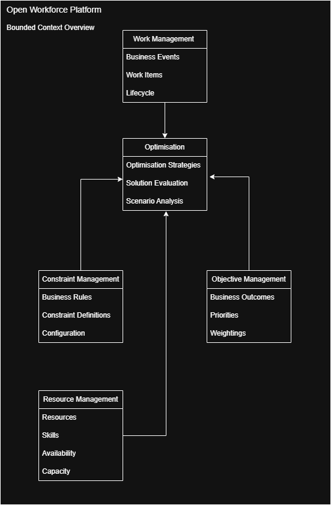

# Bounded Contexts

## Purpose

This document defines the major bounded contexts within the Open Workforce Platform.

A bounded context represents an area of the platform with clear ownership, language and responsibility.

The goal is to avoid one large, unclear domain model by separating the platform into focused business capabilities.

---

# Step 2 Objective

Define the major platform capabilities and the boundaries between them.

This document intentionally avoids implementation details such as frameworks, databases, APIs or infrastructure.

---

# Work Management Context

## Responsibility

The Work Management Context owns the definition and lifecycle of work within the platform.

It is responsible for understanding what work exists, why it exists, and its current state.

## Owns

- Business Event
- Work Item
- Work Item lifecycle
- Work Item priority
- Work Item dependencies

## Does Not Own

- Resource assignment
- Optimisation
- Routing
- Scheduling decisions
- AI recommendations

## Key Principle

Work Management defines the demand.

It does not decide how that demand should be fulfilled.

---

# Resource Management Context

## Responsibility

The Resource Management Context owns the definition, capability and availability of resources within the platform.

It is responsible for understanding what resources exist, what they are capable of doing, and when they are available.

## Owns

- Resource
- Resource type
- Skills
- Availability
- Capacity
- Qualifications
- Working patterns

## Does Not Own

- Work Item creation
- Optimisation decisions
- Final assignment decisions
- Route planning
- Business objectives

## Key Principle

Resource Management defines supply.

It does not decide how supply should be matched to demand.

---

# Optimisation Context

## Responsibility

The Optimisation Context is responsible for producing the best possible plan by matching available Resources to Work Items while satisfying Constraints and optimising for one or more Objectives.

## Owns

- Optimisation engine
- Optimisation strategies
- Solution generation
- Solution evaluation
- Scenario comparison

## Consumes

- Work Management
- Resource Management
- Constraints
- Objectives

## Does Not Own

- Work Item creation
- Resource management
- Business rules
- Route execution

## Key Principle

The Optimisation Context determines the best way to satisfy demand using available supply.

---

# Bounded Context Diagram

The diagram below illustrates the primary bounded contexts within the Open Workforce Platform and the dependencies between them.

The editable source is maintained in `bounded-contexts.drawio`.

---

# Context Relationships

The Optimisation Context consumes information from the Work Management, Resource Management, Constraint Management and Objective Management contexts.

It does not own or modify those contexts.

Its responsibility is to produce the best possible solution using the information provided.

---

# Key Principles

- Work Management defines demand.
- Resource Management defines supply.
- Constraint Management defines the business rules.
- Objective Management defines the desired business outcomes.
- Optimisation consumes information from the other contexts to generate and evaluate solutions.
- Business knowledge remains outside the optimisation engine.