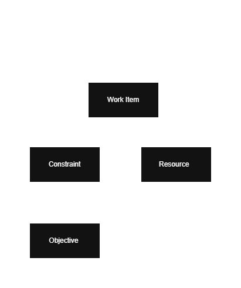

# Domain Model

## Purpose

This document defines the core business concepts used throughout the Open Workforce Platform.

The objective is to create a common language that is independent of any programming language, framework, or optimisation engine.

Every component of the platform should use the terminology defined in this document.

---

# Core Domain Concepts

## Business Event

A Business Event represents something that creates a requirement for work.

Business Events are the origin of Work Items within the platform.

Examples include:

- Customer order
- Equipment failure
- Maintenance due
- Patient referral
- Emergency incident
- Planned inspection

A Business Event may generate one or more Work Items.

## Work Item

A Work Item is created as the result of a Business Event.

A Work Item represents a piece of work that must be completed.

A Work Item may be assigned to one or more Resources during its lifecycle.

It is the fundamental concept within the Open Workforce Platform.

Every optimisation performed by the platform ultimately exists to maximise the effective completion of Work Items.

A Work Item may have characteristics such as:

- Required skills
- Expected duration
- Priority
- Time window
- Location
- Dependencies
- Business constraints

A Work Item is intentionally independent of any specific industry.

Examples include:

- Visit a patient
- Repair a gas leak
- Install broadband
- Deliver a parcel
- Inspect an aircraft
- Perform a safety check

## Resource

A Resource represents anything capable of completing one or more Work Items.

Resources are assigned Work Items by the optimisation engine.

A Resource may represent:

- Human Worker
- Vehicle
- Robot
- AI Agent
- External Contractor
- Third-party Service

Different Resource types expose different capabilities, constraints and availability.

## Constraint

A Constraint represents a rule that influences how Work Items are planned, assigned, sequenced or completed.

Constraints define what is allowed, preferred, restricted or optimised within the platform.

A Constraint may apply to:

- A Work Item
- A Resource
- A Location
- A Time Window
- A Schedule
- A Route
- An Organisation

Constraints may be classified as:

- Hard Constraint: a rule that must be satisfied.
- Soft Constraint: a rule that should be satisfied where possible.

Examples include:

- A Resource must have the required skill.
- A Work Item must be completed within a time window.
- A Resource must not exceed contracted hours.
- Travel time should be minimised.
- High-priority Work Items should be completed first.
- Work should be distributed fairly across Resources.

### Constraint Configuration

The platform provides a flexible constraint framework rather than attempting to model every possible business rule.

Each organisation is expected to define, configure and prioritise its own constraints.

This allows the platform to support multiple industries without embedding industry-specific behaviour into the core domain.

The platform provides the optimisation engine.

Organisations provide the business knowledge.

## Objective

An Objective defines what the platform should optimise.

Unlike Constraints, which determine whether a solution is valid, Objectives determine which valid solution is preferred.

Organisations may optimise for one or more objectives depending on their business priorities.

Examples include:

- Minimise travel distance
- Maximise workforce utilisation
- Minimise operational cost
- Minimise overtime
- Maximise fairness
- Reduce carbon emissions
- Maximise customer satisfaction

### Optimisation Philosophy

Different organisations optimise for different outcomes.

The platform provides the optimisation framework.

Each organisation defines its own objectives and their relative importance.

---

# Domain Model Diagram

The current domain model is illustrated below.

The editable source is maintained in `domain-model.drawio`.