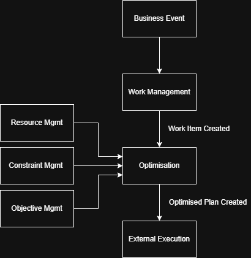

# System Overview

## Purpose

This document describes the high-level architecture of the Open Workforce Platform.

It identifies the major domains of the platform, their responsibilities, and how they collaborate.

This document intentionally avoids implementation details.

Technology choices, infrastructure and programming languages are documented separately.

---

## Architectural Goals

The platform should:

- Be modular.
- Be extensible.
- Support multiple industries.
- Separate optimisation from business logic.
- Support AI-assisted workflows.
- Be cloud-native.
- Be testable.
- Be explainable.
- Demonstrate modern AI-assisted software engineering.

---

## Core Domains

The core domains currently identified are:

- Work Management
- Resource Management
- Constraint Management
- Objective Management
- Optimisation

These domains represent business capabilities rather than technical components.

Together, they transform business demand into an optimised plan.

---

# System Flow

The platform converts business demand into an optimised plan.

```text
Business Event
      ↓
Work Management
      ↓
Optimisation
 ↑     ↑     ↑
 │     │     │
Resource Management
Constraint Management
Objective Management
      ↓
Optimised Plan
      ↓
External Execution
```

---

# System Overview Diagram

The diagram below shows how the core contexts collaborate to transform business demand into an optimised plan.



The editable source is maintained in `system-overview.drawio`.

---

# Execution Boundary

Open Workforce Platform is responsible for producing an optimised plan.

It does not assume ownership of execution.

Execution may happen in:

- A customer system
- A mobile workforce application
- A CRM system
- An ERP system
- A field service platform
- A manual operational process

This boundary keeps the platform focused on optimisation while allowing organisations to integrate the output into their existing operational systems.

---

# Collaboration Model

The platform follows an event-driven collaboration model.

Contexts publish business events when something important happens.

Other contexts may consume those events and decide whether to react.

This reduces coupling between contexts and allows the platform to evolve without requiring every context to directly know about every other context.

Example flow:

```text
Business Event Received
        ↓
Work Management creates Work Item
        ↓
Work Item Created event published
        ↓
Optimisation consumes event
        ↓
Optimised Plan created
        ↓
Optimised Plan Created event published
        ↓
External systems consume plan
```

---

# Key Architectural Principles

- The platform optimises work.
- The platform produces plans; it does not own execution.
- Contexts communicate through business events rather than direct knowledge of each other.
- Optimisation consumes demand, supply, constraints and objectives.
- Business knowledge remains outside the optimisation engine.
