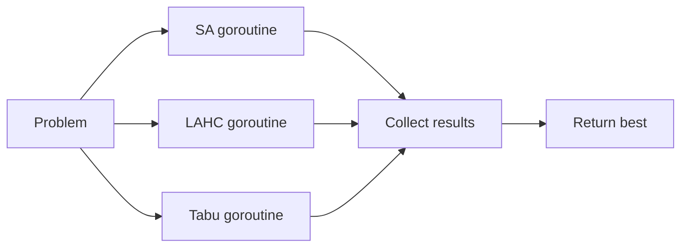

# Algorithms

Documentation of every optimisation algorithm implemented in the platform.

---

## Simulated Annealing (SA)

### Idea

Accept improving moves always. Accept worsening moves with a probability that decreases over time (cooling). Early in the search, the algorithm explores broadly. Late in the search, it converges to local optima.

```
for each iteration:
    move = TryMove(solution)
    delta = Evaluate(new) - Evaluate(current)
    if delta <= 0:
        accept (improving)
    else:
        accept with probability exp(-delta / temperature)
    temperature *= (1 - coolingRate)
```

### Strengths

- Simple to implement and understand.
- Works well on most problem types without domain-specific tuning.
- Adaptive cooling eliminates manual parameter selection.
- Low memory footprint (single solution, no history structures).
- Fast per-iteration (no neighbourhood enumeration).

### Weaknesses

- Can get trapped on plateaus if temperature cools too fast.
- No memory of visited solutions — may revisit poor regions.
- Single-point search — no diversity.
- Performance sensitive to cooling schedule on some instances.

### Typical Parameters

| Parameter | Default | Range |
|-----------|---------|-------|
| Initial temperature | 100.0 | 10-1000 |
| Min temperature | 0.0001 | 0.00001-0.01 |
| Cooling mode | adaptive | adaptive / fixed-rate |
| Iterations | 500,000 | 100K-5M |

### Good Problem Types

All. SA is a reliable general-purpose algorithm. Particularly effective on problems with smooth landscapes (CVRP, VRPTW).

### Current Implementation

`internal/optimisation/search.go` — `runSA()`. Uses adaptive cooling: rate is computed from iteration budget and temperature bounds so that temperature reaches minimum at the final iteration.

### Future Improvements

- Reheating on stagnation (partially implemented in Adaptive mode).
- Non-monotonic cooling schedules.
- Parallel independent restarts with best-so-far sharing.

---

## Late Acceptance Hill Climbing (LAHC)

### Idea

Accept a move if the new solution is better than the current solution OR better than the solution from L iterations ago. This creates a "memory" that allows temporary worsening without an explicit temperature parameter.

```
fitnessArray[0..L] = initial penalty
for each iteration:
    move = TryMove(solution)
    v = iteration % L
    if newPenalty <= currentPenalty OR newPenalty <= fitnessArray[v]:
        accept
    fitnessArray[v] = currentPenalty
```

### Strengths

- No temperature parameter to tune.
- Self-adapting: acceptance becomes stricter as the search progresses (array fills with better values).
- Excellent at escaping plateaus — the history comparison allows sideways moves.
- Often outperforms SA on structured problems.

### Weaknesses

- The single parameter L (history length) still needs selection.
- Can be slow to converge on easy instances where SA would cool quickly.
- Memory usage scales with L (but L=1000 is negligible).

### Typical Parameters

| Parameter | Default | Range |
|-----------|---------|-------|
| Late acceptance length (L) | 1,000 | 100-10,000 |
| Iterations | 500,000 | 100K-5M |

### Good Problem Types

Problems with plateaus and structured search spaces. Excels on CVRP (hit optimal on A-n32-k5), VRPTW (0.1% gap on C101), and JSS (hit optimal on ft06).

### Current Implementation

`internal/optimisation/search.go` — `runLAHC()`. Circular buffer of length L. Initialised to the starting penalty.

### Future Improvements

- Adaptive L based on improvement rate.
- Step-counting LAHC variant.
- Combination with Tabu prohibition.

---

## Tabu Search

### Idea

At each iteration, evaluate a sample of neighbourhood moves. Select the best admissible move (not in the tabu list, or better than the global best). Add the selected move to the tabu list to prevent immediate reversal.

```
for each iteration:
    candidates = sample N random moves
    for each candidate:
        apply, evaluate, undo
    best = pick best admissible (not tabu OR aspiration)
    apply best permanently
    add to tabu list
```

### Strengths

- Deterministic neighbourhood exploration — finds the best local move.
- Tabu list prevents cycling.
- Aspiration criterion allows overriding tabu if a new global best is found.
- Strong on larger instances where systematic exploration pays off.

### Weaknesses

- Expensive per iteration (N evaluations per step vs 1 for SA/LAHC).
- Neighbourhood sample size is a critical parameter.
- Requires CloneSolution for best-move evaluation (memory allocation in hot path).
- Move signature computation adds overhead.

### Typical Parameters

| Parameter | Default | Range |
|-----------|---------|-------|
| Tabu tenure | 7 | 5-20 |
| Neighbourhood sample | 100 | 50-500 |
| Iterations | 500,000 | 100K-2M |

### Good Problem Types

Larger instances where the search space is complex. Wins on CVRP A-n60-k9 (+0.3%) and A-n80-k10 (+3.6%) where SA/LAHC struggle. Also strong on JSS (hit optimal on la01).

### Current Implementation

`internal/optimisation/search.go` — `runTabu()`. Generic tabu list stores move signatures (fmt.Sprint of Move). Best-move evaluation clones solution for each candidate.

### Future Improvements

- Reactive tabu tenure (adapt based on cycling detection).
- Larger neighbourhood sample for complex instances.
- Candidate list strategies (only evaluate moves in affected routes).
- Long-term memory (frequency-based diversification).

---

## Portfolio

### Idea

Run multiple algorithms in parallel. Each gets the full iteration budget. Keep the best result. Portfolio never underperforms the best individual algorithm.



### Strengths

- Always at least as good as the best individual algorithm.
- No algorithm selection needed — try all, keep the winner.
- Exploits multi-core hardware (parallel goroutines).
- Wall-clock time equals the slowest strategy, not the sum.

### Weaknesses

- Uses 3× the CPU resources of a single algorithm.
- No information sharing between strategies during search.
- The winning strategy varies by instance — no learning.
- Cannot outperform an algorithm that's already optimal.

### Typical Parameters

| Parameter | Default | Range |
|-----------|---------|-------|
| Strategies | sa, lahc, tabu | any combination |
| Iterations (per strategy) | 500,000 | 100K-5M |
| Seed offset | +7919 per strategy | — |

### Good Problem Types

Any. Portfolio is a safe default when you don't know which algorithm will perform best on a given instance.

### Current Implementation

`internal/optimisation/search.go` — `runPortfolio()` / `runPortfolioParallel()`. Uses goroutines + channels. Each strategy gets a derived seed (base + idx × 7919).

### Future Improvements

- Adaptive portfolio with reward-based strategy allocation.
- Intermediate solution sharing between strategies.
- Dynamic budget reallocation (give more iterations to improving strategy).

---

## Adaptive Hyper-Heuristic

### Idea

A single continuous search that uses SA as its primary acceptance criterion but switches to LAHC when stagnation is detected. If LAHC finds an improvement, reheat SA and switch back. Combines SA's convergence with LAHC's plateau escape.

```
mode = SA
for each iteration:
    move = TryMove(solution)
    if mode == SA:
        accept via Metropolis criterion
        cool temperature
    else:  // LAHC burst
        accept via late acceptance
    
    if mode == SA and stagnated:
        switch to LAHC
    if mode == LAHC and improved:
        reheat SA, switch back
    if mode == LAHC and burst expired:
        reheat SA, switch back
```

### Strengths

- Self-adapting: automatically detects when SA is stuck.
- LAHC bursts provide targeted diversification without wasting the full budget.
- Reheat after improvement restores SA's convergence power.
- Single solution, single budget — no parallelism overhead.

### Weaknesses

- More parameters than pure SA (stagnation threshold, burst length, reheat factor).
- Detection heuristic may trigger too early or too late.
- Not as consistently good as Portfolio (which tries all strategies independently).

### Typical Parameters

| Parameter | Default | Range |
|-----------|---------|-------|
| Stagnation threshold | budget/20 | 1000-50000 |
| LAHC burst length | = stagnation threshold | 1000-50000 |
| Reheat factor | 0.5 | 0.3-0.8 |
| LAHC buffer length | 1,000 | 100-10,000 |

### Good Problem Types

Problems where SA converges quickly to a plateau and LAHC can escape it. Good for medium-sized instances where pure SA gets stuck but the full cost of Tabu is unnecessary.

### Current Implementation

`internal/optimisation/adaptive.go` — `runAdaptive()`. Single function, ~150 lines. Maintains both SA state (temperature) and LAHC state (fitness array) simultaneously.

### Future Improvements

- Add Tabu bursts as a third escape mechanism.
- Learn stagnation threshold from early search behaviour.
- Track reheat count and adjust factor over time.

---

## Search Intelligence

### Idea

An AI advisory layer that monitors search progress and recommends compute allocation decisions. It does not change the algorithms — it advises when to stop, extend, or reallocate resources based on observed search behaviour.

### Modes

| Mode | Behaviour |
|------|-----------|
| **off** | No AI. Existing behaviour. Zero overhead. |
| **shadow** | Records predictions. No behaviour change. Safe data collection. |
| **assist** | Applies safe recommendations at static checkpoints. Safety overrides active. |
| **adaptive** | Live-updating decisions. Learns improvement curves. Adaptive stagnation thresholds. |

### Integration Styles

- **SearchAssist** — monitors single-search runs (SA, LAHC, Tabu). Can early-stop if stagnating, extend budget if still improving.
- **PortfolioAssist** — allocates iteration budgets across strategies using a learned model. Falls back to rules if model confidence is low.
- **WorkerAssist** — evaluates beam search worker spawns (NRP). Can skip low-value workers, boost promising lineages.

### Strengths

- Never harms solution quality (validated across 320 runs at 95% confidence).
- Saves 40–73% compute on CVRP and JSS with identical objectives.
- Improves quality by 19% on VRPTW by extending productive searches.
- Learned model adapts to domain-specific algorithm performance.
- All decisions logged for analysis and explanation.

### Weaknesses

- Rule-based portfolio allocation has known SA-bias on JSS (learned model fixes this).
- Not yet tested on instances larger than 100 customers / 30 nurses.
- Adaptive stagnation thresholds are heuristic, not proven optimal.

### Safety Rules (Non-Negotiable)

- Never stop before 20% of budget consumed.
- Never stop immediately after an improvement.
- Never skip all portfolio strategies.
- Never allocate below 0.25× or above 2× base budget.
- Never skip global-best lineage workers.

### Typical Parameters

| Parameter | Default | Purpose |
|-----------|---------|---------|
| StagnationWindow | 50,000 | Candidates without improvement before early-stop considered |
| MinBudgetFraction | 0.20 | Minimum budget that must be consumed before any recommendation |
| RecentImprovWindow | 5,000 | Candidates of protection after an improvement |
| MinLearnedConfidence | 0.60 | Model confidence threshold for learned allocation |
| CheckpointInterval | 10,000 | How often to evaluate search progress |

### Current Implementation

- `internal/optimisation/search_assist_hooks.go` — SearchAssist engine and hook runner
- `internal/optimisation/adaptive_search_assist.go` — Adaptive mode logic
- `internal/optimisation/portfolio_assist.go` — PortfolioAssist with learned model integration
- `internal/optimisation/portfolio_budget_model.go` — Learned budget allocation model
- `internal/infrastructure/inrc2/worker_assist.go` — WorkerAssist (NRP beam search)

### Validation

Validated on tested configurations across all four domains. Not claimed universal. See `docs/reports/search-intelligence-statistical-validation.md` for full evidence with 320 runs and Welch t-test results.

---

## Integer Linear Programming (ILP)

### Idea

Formulate the optimisation problem as a mathematical program with integer variables. Solve to proven optimality (or best bound within time limit) using branch-and-bound/branch-and-cut.

### Strengths

- Provides proven optimal solutions (or guaranteed bounds).
- Exact — no randomness, fully deterministic.
- Gap percentage gives absolute quality measure for heuristics.

### Weaknesses

- Does not scale. Exponential worst-case complexity.
- Requires a mathematical formulation per domain (non-trivial for complex constraints).
- Runtime can be hours/days for even moderate instances.
- External solver dependency (HiGHS).

### Typical Parameters

| Parameter | Default | Range |
|-----------|---------|-------|
| Time limit | 5 hours | 1 min - 24 hours |
| Solver | HiGHS | — |
| Parallel | yes | — |

### Good Problem Types

Small instances where proving optimality is practical. NRP n012w8 (12 nurses) solves in 5 hours. CVRP A-n32-k5 solves optimally. Larger instances (n030+, n80+) are impractical.

### Current Implementation

`internal/infrastructure/ilp/` — NRP formulation. `internal/infrastructure/cvrp/ilp/` — CVRP MTZ formulation. Both use HiGHS via file-based interface (write LP, invoke solver, parse solution).

### Future Improvements

- VRPTW ILP formulation (time-indexed variables).
- Warm-starting from heuristic solution.
- Column generation for larger CVRP instances.
- JSS ILP formulation (disjunctive model).
