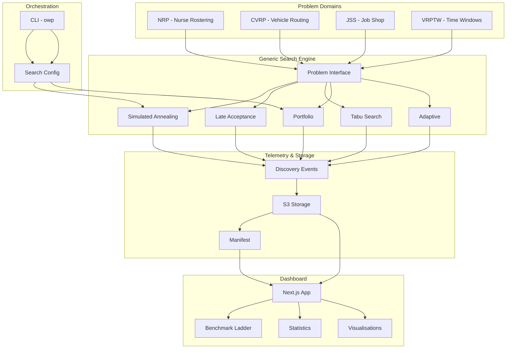
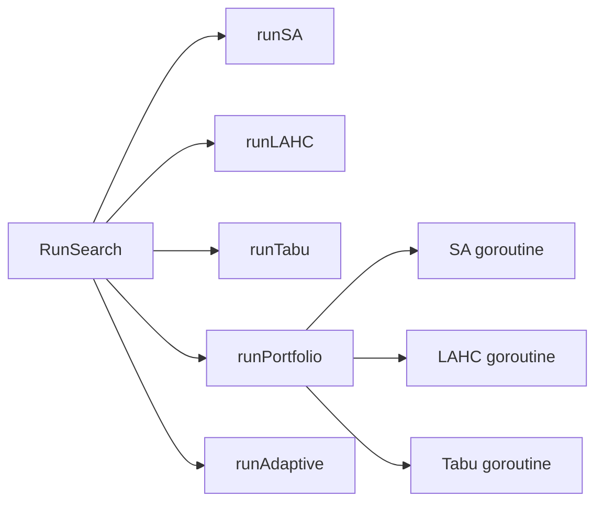
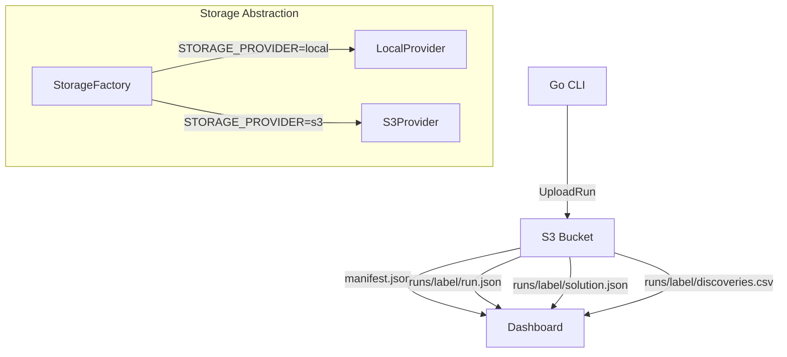

# Architecture

Implementation-focused architecture reference for the PFRS Research Lab platform.

---

## System Overview



---

## Layer 1: Problem Interface

The `Problem` interface is the contract between domain knowledge and search algorithms.

```go
type Problem interface {
    CreateInitialSolution() (Solution, error)
    CloneSolution(s Solution) Solution
    Evaluate(s Solution) int
    TryMove(s Solution, rng *rand.Rand) MoveResult
    UndoMove(s Solution, m Move)
    SolutionFingerprint(s Solution) string
    SerializeSolution(s Solution) ([]byte, error)
}
```

### Why an Interface?

Algorithms call `Evaluate` millions of times per second. They call `TryMove` and `UndoMove` in tight loops. They never inspect what a `Solution` contains — it's an opaque handle.

This means:

- SA does not know if it is optimising a nurse roster or a vehicle route.
- Adding VRPTW required zero changes to SA, LAHC, Tabu, or Portfolio.
- Each domain owns its own solution representation, move types, and constraint logic.
- Algorithms are tested once and work for all domains.

### Implementation Pattern

Each domain provides:

| File | Responsibility |
|------|---------------|
| `types.go` | Domain value objects (Customer, Job, Depot, etc.) |
| `dataset.go` | Instance loading and conversion |
| `problem.go` | Problem interface implementation |
| `constructive.go` | Initial solution heuristic |
| `neighbourhood.go` | Move generation with undo |
| `scorer.go` | Detailed scoring and validation |

### Adding a New Domain

1. Create package under `internal/infrastructure/<domain>/`.
2. Implement the 7 methods of `Problem`.
3. Add a CLI command (`solve-<domain>`).
4. The domain immediately works with all 5 algorithms.

No changes to `internal/optimisation/` are required.

---

## Layer 2: Search Algorithms

All algorithms live in `internal/optimisation/` and depend only on the `Problem` interface.



### Simulated Annealing

Metropolis acceptance. Adaptive cooling rate computed from iteration budget and temperature bounds. Single continuous search.

### Late Acceptance Hill Climbing

Accepts if the new penalty is ≤ current OR ≤ the penalty from L iterations ago. Circular buffer of length L (default 1000).

### Tabu Search

Best-move strategy. Samples N moves per iteration (default 100), evaluates all, picks the best admissible (not in tabu list or improves global best). Tabu list is a circular buffer of move signatures.

### Portfolio

Runs multiple strategies in parallel goroutines. Each gets its own `Problem` instance (via `CreateInitialSolution`). Collects results via channels. Returns the best.

### Adaptive

Single continuous search using SA as primary. Detects stagnation (no improvement for N iterations). Switches to LAHC acceptance for a burst. If LAHC finds improvement, reheats SA and switches back. Combines SA's convergence with LAHC's plateau escape.

### SearchResult

Every algorithm returns:

```go
type SearchResult struct {
    BestSolution   Solution
    BestPenalty    int
    InitialPenalty int
    Candidates     int
    Accepted       int
    Improved       int
    DurationMs     int64
    Discoveries    []Discovery
}
```

`Discoveries` records every global best improvement with elapsed time and candidate count — this is the primary telemetry signal.

---

## Layer 3: Orchestration (CLI)

The `owp` CLI dispatches to domain-specific solvers:

```
owp solve-cvrp    → loads CVRPLIB instance → creates CVRPProblem → RunSearch
owp solve-jobshop → loads Taillard instance → creates JSSProblem → RunSearch
owp solve-vrptw   → loads Solomon instance → creates VRPTWProblem → RunSearch
owp tune-pfrs     → loads INRC-II scenario → beam search with per-week SA/LAHC
```

Each command:
1. Parses flags (mode, iterations, seed, storage).
2. Loads and validates the instance.
3. Creates the Problem.
4. Builds initial solution (constructive heuristic).
5. Runs the search via `optimisation.RunSearch(problem, config)`.
6. Writes `run.json`, `solution.json`, `discoveries.csv`.
7. Optionally uploads to S3 via `s3upload.UploadRun(...)`.

---

## Layer 4: Telemetry

### Discovery Events

The core telemetry signal. Every time a search finds a new global best:

```go
type Discovery struct {
    ElapsedMs   int64
    Candidate   int
    OldBest     int
    NewBest     int
    Improvement int
}
```

Written to `discoveries.csv`. The dashboard plots these as convergence curves and discovery timelines.

### Run Metadata (`run.json`)

Standardised contract between Go CLI and dashboard:

```json
{
  "problemType": "cvrp",
  "mode": "sa",
  "instance": "A-n32-k5",
  "bestObjective": 784,
  "iterations": 500000,
  "seed": 42,
  "runtimeMs": 84,
  "runLabel": "cvrp-a32k5-sa"
}
```

`bestObjective` is the universal field. Domain-specific fields (`bestDistance`, `bestMakespan`, `totalPenalty`) are kept for backwards compatibility.

---

## Layer 5: Storage



### Storage Abstraction

The dashboard reads data through a `StorageProvider` interface:

```typescript
interface StorageProvider {
  listRuns(): Promise<string[]>;
  exists(runId: string, filename: string): Promise<boolean>;
  readFile(runId: string, filename: string): Promise<string | null>;
}
```

Two implementations:
- **LocalProvider** — reads from `data/runs/` on disk (development).
- **S3Provider** — reads from S3 bucket (production).

Selected via `STORAGE_PROVIDER` environment variable. The dashboard code never knows which backend it's using.

### S3 Layout

```
pfrs-research-lab-data/
├── manifest.json              # Index of all runs
└── runs/
    └── <runLabel>/
        ├── run.json           # Metadata (schema documented in admin page)
        ├── solution.json      # Domain-specific solution
        ├── results.csv        # Search progress / audit log
        └── discoveries.csv    # Global best improvements
```

### Shared Upload Function

All CLI commands use a single `s3upload.UploadRun(...)` function:

```go
s3upload.UploadRun(storageMode, s3upload.UploadRunConfig{
    RunLabel: runLabel,
    RunDir:   outputDir,
    Algorithm: mode,
    Penalty:  bestObjective,
    Bucket:   bucket,
    Region:   region,
})
```

No-op if `storageMode != "s3"`. Handles directory scan, file upload, and manifest update.

---

## Layer 6: Dashboard

### Technology

- Next.js 16 (App Router, Server Components)
- React 19
- Tailwind CSS
- Deployed on AWS ECS Fargate
- CI/CD via GitHub Actions + semantic-release

### Page Architecture

```mermaid
graph TD
    HOME[/ Home]
    BENCH[/benchmarks]
    STATS[/statistics]
    ADMIN[/admin]
    RUN[/runs/id/summary]
    GANTT[/runs/id/gantt]
    SEARCH[/runs/id/search]
    ROUTES[/runs/id/routes]

    HOME --> BENCH
    HOME --> STATS
    HOME --> ADMIN
    HOME --> RUN
    RUN --> GANTT
    RUN --> SEARCH
    RUN --> ROUTES
```

### Data Flow

1. Page loads (server component).
2. `getStorageProvider()` returns S3Provider (production).
3. Provider reads `manifest.json` → list of run IDs.
4. For each relevant run, reads `run.json` → metadata.
5. Server component renders with data.
6. Client components handle interactivity (filters, charts).

### Domain-Specific Rendering

The summary page detects `problemType` from metadata and renders the appropriate layout:

- **NRP**: penalty, weeks, workers, per-week breakdown.
- **CVRP**: distance, improvement, feasibility, customers.
- **JSS**: makespan, jobs, machines.
- **VRPTW**: distance, vehicles used, feasibility, time windows.

The sidebar navigation adapts per domain (Gantt for JSS, Route Viewer for CVRP/VRPTW, Beam Search for NRP).

---

## Design Decisions

| Decision | Rationale |
|----------|-----------|
| Problem is an interface | Algorithms don't change when domains are added |
| Opaque Solution/Move types | No type assertion in hot path, each domain owns its representation |
| Pre-computed distance matrices | Evaluate is called millions of times, must be O(1) per edge |
| S3 manifest pattern | Dashboard discovers runs without scanning bucket |
| Server components for data loading | No client-side S3 credentials needed |
| `bestObjective` as universal field | Dashboard doesn't need domain-specific logic to read objectives |
| Shared `UploadRun` function | Single implementation prevents upload bugs across domains |

---

## Layer 7: Search Intelligence

### Overview

Search Intelligence is a universal AI advisory system that allows AI to advise any solver on compute allocation. It operates in four modes:

- **off** (default): no AI, zero overhead, existing behaviour unchanged
- **shadow**: AI observes and records predictions, no behaviour change
- **assist**: AI recommendations are acted upon with hard safety overrides (static checkpoints)
- **adaptive**: live-updating decisions based on observed search progress, learned models, and dynamic stagnation thresholds

### Integration Styles

| Style | Solver Architecture | Domains | Actions |
|-------|-------------------|---------|---------|
| WorkerAssist | Beam search | NRP | Skip/reduce/increase/change workers |
| SearchAssist | Single-search | CVRP, JSS, VRPTW | Early stop, budget extend, budget reduce |
| PortfolioAssist | Portfolio | CVRP, JSS, VRPTW, NRP | Budget allocation across strategies (learned model) |

### CLI Flag

All solver commands accept `--worker-decision-mode off|shadow|assist|adaptive`.

Portfolio assist optionally uses a learned model: `--portfolio-model <path>`.

### Telemetry Files

| File | When Generated |
|------|---------------|
| `worker_assist.csv` | NRP assist/adaptive mode |
| `generic_search_assist.csv` | Single-search shadow/assist/adaptive |
| `portfolio_assist.csv` | Portfolio shadow/assist/adaptive |
| `adaptive_assist.csv` | Adaptive mode (same format as generic_search_assist) |

### Safety (Non-Negotiable)

Every integration style has hard safety rules that cannot be overridden by the AI:

- WorkerAssist: never skip global-best lineage, never skip low-confidence, require 3+ signals
- SearchAssist: never stop before minimum budget, never stop after recent improvement
- PortfolioAssist: never skip all strategies, minimum 2 must run, max 2× boost, min 0.25× floor

### Learned Budget Allocation

PortfolioAssist can use a learned model (`portfolio_budget_model.json`) trained on historical telemetry. Falls back to rule-based allocation if model is missing, confidence is low, or insufficient training data exists.

### Validation Status

Validated safe on all four domains (NRP, CVRP, JSS, VRPTW) with 320 statistical validation runs across 10 seeds. Welch t-test confirms assist/adaptive never statistically worse than off at 95% confidence. VRPTW adaptive produces 19% better quality (p<0.001). CVRP/JSS save 40–73% compute with identical quality.

Validated on tested configurations. Not claimed universal.

See:
- `docs/reports/search-intelligence-statistical-validation.md`
- `docs/reports/search-intelligence-large-benchmark-validation.md`
- `docs/reports/search-intelligence-failure-analysis.md`

### Architecture Diagram

```
SearchIntelligence
├── WorkerAssist → PFRS Beam Search (submitWork)
├── SearchAssist → RunSearch (SA/LAHC/Tabu checkpoint hooks)
│   ├── RuleBasedSearchAssist (static thresholds)
│   └── AdaptiveSearchAssist (live-updating, learned stagnation windows)
└── PortfolioAssist → RunPortfolioWithAssist (budget allocation)
    ├── RuleBasedPortfolioAdvisor (fixed heuristics)
    └── LearnedPortfolioAdvisor (data-driven model with fallback)
```
